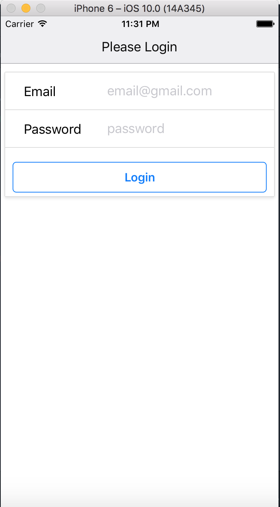

## About Employee Tracker ##
A cross platform iOS and Android application built with React Native. Register as an employer, add and schedule employees for work. Text employees their schedules.

## INSTRUCTIONS ##
1. Run npm init
2. Run react-native run-ios OR react-native run-android depending on desired platform.

